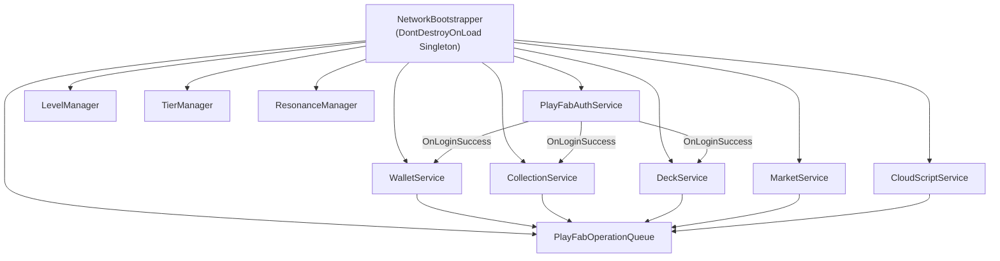
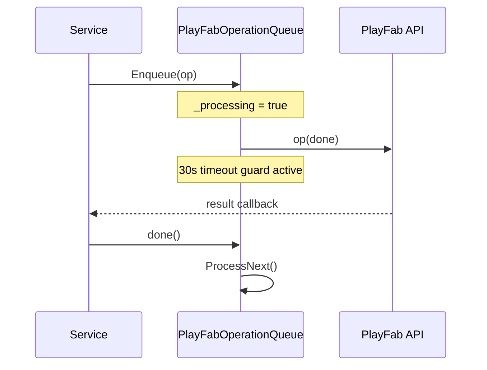

# Dystopia


> A server-authoritative turn-based card battle game with real-time economy, player-to-player trading, and multiplayer-forward architecture. Built solo in Unity/C# with a PlayFab backend.

<!-- TODO: Add a gameplay GIF or screenshot here once available -->
<!--  -->

**[▶ Play in Browser](https://kanekisaneki1234.github.io/Portfolio_Website/dystopia/)** · **[Portfolio Page](https://kanekisaneki1234.github.io/Portfolio_Website/dystopia.html)**

---

## Overview

Dystopia is a turn-based card battle game where players collect cards across six distinct classes, build 3-card decks, and battle AI opponents in 3v3 team combat. Abilities span six types — Damage, Heal, StatModifier, DoT, Shield, and ManaDrain — with a round-robin auto-queue and a timed manual override window per round.

What makes this project technically substantial is the **production-grade backend architecture**. All currency grants, card upgrades, and market transactions are validated server-side through PlayFab Cloud Scripts. A global operation queue serialises every PlayFab API call into a single FIFO lane, eliminating an entire class of rate-limit errors. Multi-resource transactions are atomic — if one part of a Tier Up fails, nothing is deducted.

The battle system is built around an `IAbilitySelector` interface that completely decouples input from logic. Whether ability selections come from a local UI, an AI, or a future `NetworkAbilitySelector`, the battle flow is identical. Swapping in real-time multiplayer requires zero changes to `GameStateManager`.

---

## Architecture

### Service Layer (DontDestroyOnLoad)

All core services are instantiated once in `NetworkBootstrapper` and persist across all 6 scenes. No service holds a direct reference to a MonoBehaviour it doesn't own.



Login success triggers a cascade: `WalletService` fetches currencies and materials, `CollectionService` fetches the card inventory, then `DeckService` fetches decks (after inventory is populated, guaranteeing card references resolve correctly).

### Global Operation Queue

Every PlayFab call — across every service — is routed through a single `PlayFabOperationQueue`. This was the fix for 4 interconnected rate-limit bugs that all traced to one root cause: PlayFab's per-title API rate limit being exceeded when multiple services fired simultaneously on login.



Each operation receives a `done()` callback it must call exactly once. A 30-second coroutine timeout forces the queue to advance if an operation stalls — preventing a single failed call from deadlocking the entire game.

### Battle System

```
GameStateManager (FSM)
│
├── BattleState: Idle → Setup → RoundStart → AbilityWindow → Resolution → RoundEnd → Victory/Defeat/Draw
│
├── IAbilitySelector (_playerSelector, _enemySelector)
│   ├── LocalAbilitySelector  — waits for UI button tap
│   ├── AIAbilitySelector     — picks randomly/by logic
│   └── NetworkAbilitySelector (future) — waits for network message
│
└── BattleSimulator (static)
    └── Pure math: stat aggregation, damage formula, DoT ticks, mana regen
```

`GameStateManager` calls `_selector.BeginSelection(team, windowSeconds)` and awaits `OnReady`. It has no knowledge of what's on the other side. Plugging in a network implementation requires no changes to the FSM.

---

## Key Technical Decisions

### Why server-authoritative instead of client-trusted?

Client-trusted economies are trivially exploitable — intercept the response, modify the gold value, replay it. Every currency grant in Dystopia goes through a Cloud Script handler that validates the request, caps the amount, and writes to PlayFab's authoritative store. The client never touches a currency value directly.

### Why a global operation queue?

During development, wallet, inventory, cloud scripts, and pack opening all fired PlayFab calls concurrently on login. Each individually worked fine in isolation. Together, they pushed past PlayFab's per-title rate limit, causing silent failures. The queue makes the constraint explicit: operations run one at a time, in order, with a timeout safety net. This pattern is used in production by studios like Supercell for the same reason.

### Why escrow for the marketplace?

Without escrow, a seller could list a card, sell it to a buyer, then also keep using it — the card existing in two places. With escrow, the card physically leaves the seller's `CollectionService` when listed. The cooldown persists on the card even after cancellation to prevent manipulation patterns (rapid list/delist to reset pricing).

### Why `IAbilitySelector` as a Strategy pattern?

Hardcoding `AIAbilitySelector` into `GameStateManager` would require a rewrite to add local player input or network play. The interface makes `GameStateManager` input-agnostic — it depends on the abstraction, not the implementation. This is the Dependency Inversion Principle in practice: the high-level battle orchestrator never imports a concrete selector type.

---

## Design Patterns

| Pattern | Location | What It Does |
|---------|----------|--------------|
| **Strategy** | `IAbilitySelector` → `AIAbilitySelector` | Decouples ability input source from battle flow. Swap AI for local/network with zero changes to `GameStateManager`. |
| **Observer** | `BattleEvents`, `GameEvents` | Static `Action` delegate buses for decoupled UI updates. `BattleEvents.ClearAllListeners()` prevents stale subscriptions across battle scene loads. |
| **Command** | `PlayFabOperationQueue` | Wraps each PlayFab call as an `Action<Action>` (operation + done callback), serialised into a FIFO queue with timeout safety. |
| **Singleton** | `NetworkBootstrapper` | Single persistent service container across all scenes via `DontDestroyOnLoad`. All services are properties on this one instance. |
| **State** | `GameStateManager` | Explicit FSM with `BattleState` enum. Each state transition is a deliberate method call — no implicit state from scattered booleans. |
| **Template Method** | `AbilityData` subclasses | `AbilityData` defines the `Execute(AbilityContext)` contract; `DamageAbility`, `HealAbility`, `DotAbility`, etc. override the implementation. |

---

## Tech Stack

| Layer | Technology |
|-------|-----------|
| Engine | Unity (C#) |
| Backend | Microsoft PlayFab |
| Server Logic | PlayFab Cloud Scripts — JavaScript, 10 handlers |
| Authentication | PlayFab Email/Password + Anonymous (Guest) |
| Economy | PlayFab Virtual Currencies (GD/FR/DM + class materials) |
| Inventory | PlayFab Inventory + Custom Item Data |
| Data Persistence | PlayFab Player Data |
| Platforms | macOS · Windows · WebGL |

---

## How to Run

> **Note:** This repo contains C# scripts only. It is not the full Unity project.
> A playable build is available on the [portfolio page](https://kanekisaneki1234.github.io/Portfolio_Website/dystopia.html).

To run the project locally:

1. Clone the full Unity project (contact for access — assets are not in this repo)
2. Open with **Unity 2022.3 LTS**
3. Install the **PlayFab Unity SDK** via the Package Manager
4. In `Assets/PlayFabSDK/Shared/Public/PlayFabSettings.cs`, set your `TitleId`
5. Set up your PlayFab title with the Cloud Scripts in `/CloudScripts/` (contact for the JS handlers)
6. Open the `TitleScene` and press Play

---

## Scenes

| Scene | Purpose |
|-------|---------|
| **TitleScene** | Login and signup with email/password or anonymous guest |
| **MainMenuScene** | Hub — navigate to Battle, Collection, Market, or Shop |
| **BattleScene** | 3v3 turn-based combat with AI opponent |
| **CollectionScene** | Card browser, upgrade panel (Level/Tier/Resonance), and deck builder |
| **MarketScene** | Player-to-player marketplace — browse, buy, list, and cancel listings |
| **ShopScene** | Gacha pack shop, daily login rewards, and class material purchases |

---

## Future Work

- **Real-time multiplayer** — `NetworkAbilitySelector` implementation using Unity Netcode or Photon. The `IAbilitySelector` interface is already in place; the FSM requires no changes.
- **Smart market pricing** — Rolling average per base card ID with a 50–200% cap relative to the average, to prevent price manipulation and give sellers a reference point.
- **Expanded card roster** — Currently 7 cards across 6 classes. Each new card is a `CardData` ScriptableObject — no code changes required.
- **Push notifications** — Alert sellers when their listed card sells.
- **Ranked season system** — Leaderboard with Elo-style rating and seasonal resets.
